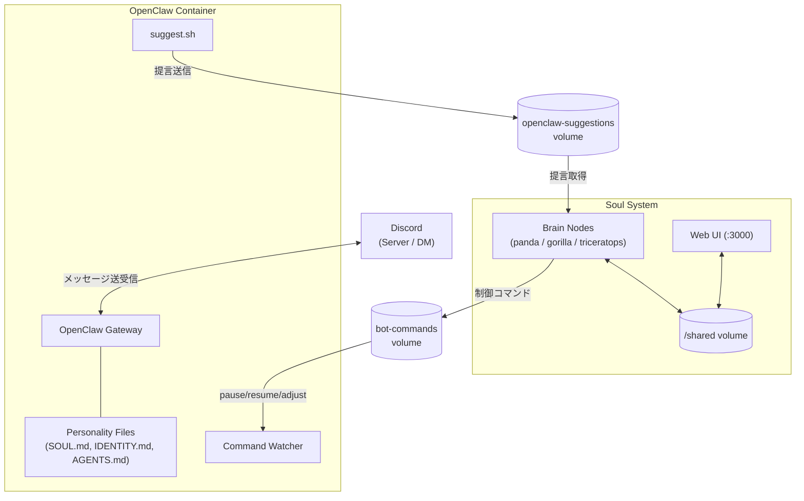

# Soul System

呪術廻戦のパンダに着想を得たマルチエージェントAIシステム。
3つのBrainノード（パンダ・ゴリラ・トリケラトプス）が相互に議論・評価し合いながら、自律的にタスクを遂行する。

> パンダが自律した受戒として成立するには、3つの魂がお互いに干渉し合うことが必要。

## Mission

本システムの存在意義は **Masaru Tamegaiとその家族の幸福化、および資産拡大** である。
すべての判断・行動はこのミッションに照らして評価・実行される。

## Architecture

```
┌──────────────────────── Soul System ────────────────────────┐
│                                                              │
│  ┌────────────┐  ┌────────────┐  ┌────────────────────┐    │
│  │brain-panda │  │brain-      │  │brain-triceratops   │    │
│  │  (安全重視) │  │  gorilla   │  │    (調停者)         │    │
│  │            │  │  (冒険的)   │  │                    │    │
│  │Claude Code │  │Claude Code │  │  Claude Code       │    │
│  │+soul-daemon│  │+soul-daemon│  │  +soul-daemon      │    │
│  └─────┬──────┘  └─────┬──────┘  └──────────┬─────────┘    │
│        │               │                     │              │
│        └───────────────┼─────────────────────┘              │
│                        │                                    │
│               ┌────────▼────────┐    ┌──────────────────┐   │
│               │  /shared volume │    │  Web UI (:3000)  │   │
│               │                 │◄───│  (Express + SSE) │   │
│               │  inbox/         │    └──────────────────┘   │
│               │  discussions/   │                           │
│               │  decisions/     │                           │
│               │  evaluations/   │                           │
│               │  logs/          │                           │
│               └────────┬────────┘                           │
│                        │                                    │
│  ┌─────────────────────▼────────────────────────────────┐   │
│  │                 Worker Nodes                          │   │
│  │  ┌──────────┐  ┌──────────┐  ┌──────────┐           │   │
│  │  │ OpenClaw │  │ Worker-2 │  │ Worker-N │           │   │
│  │  └──────────┘  └──────────┘  └──────────┘           │   │
│  └──────────────────────────────────────────────────────┘   │
│                                                              │
│  ┌──────────────┐                                           │
│  │  scheduler   │ ← 定期評価サイクル発火(6h毎)              │
│  └──────────────┘                                           │
└──────────────────────────────────────────────────────────────┘
```

## Concept

### 3つのBrainノード

| ノード | 特性 | 役割 | モデル |
|--------|------|------|--------|
| **Panda** (パンダ) | 慎重派・リスク管理 | 家族の安全・資産保全を最優先、リスク面の指摘 | Sonnet |
| **Gorilla** (ゴリラ) | 革新派・成長推進 | 資産拡大・新機会の追求、コーディネーター | Sonnet |
| **Triceratops** (トリケラトプス) | 調停者・実行者 | 視点の統合・最終判断・決定発表・タスク実行 | Opus |

各ノードは独立したDockerコンテナで稼働し、Claude Codeをエージェントとして搭載する。
性格は `CLAUDE.md`（システムプロンプト）と `params.json`（数値パラメータ）で定義される。

### 合意形成メカニズム

- **タスク駆動**: タスクが投入されると3ノードで議論し、2/3の合意で実行
- **定期評価**: スケジューラが6時間毎に相互評価サイクルを発火
- **パラメータチューニング**: 2/3が合意すれば、残り1ノードのパラメータを変更し再作成

### Workerノード

Brainノードの合意形成のもとで作成・運用されるアプリケーション実行ノード。
最初のWorkerとして **OpenClaw（Masaru-kun bot）** が稼働中。

## OpenClaw（Masaru-kun Bot）

### 概要

OpenClawはSoul Systemの最初のWorkerノードとして稼働するDiscord botである。
オーナー（Masaru Tamegai）の人格を模した「Masaru-kun」というバディAIとして、Discordサーバー・DMで友人やコミュニティとの対話を行う。
Soul Systemのミッション（家族の幸福化・資産拡大）に沿い、情報提供・提言・日常会話を通じてオーナーをサポートする。

OpenClawは独自のDockerコンテナ（`soul-openclaw`）で稼働し、専用ネットワーク（`br-openclaw`）に隔離されている。
Brainノードとの通信は共有ボリューム（`bot-commands`、`openclaw-suggestions`）を介したファイルベースで行われる。

### アーキテクチャ



### Bot構成

| コンポーネント | ファイル | 役割 |
|---------------|---------|------|
| **OpenClaw Gateway** | `entrypoint.sh` | Discord接続・LLMによる対話処理のメインプロセス |
| **Command Watcher** | `command-watcher.sh` | Brainからの制御コマンド（pause/resume/restart/adjust_params）を監視・実行 |
| **Suggestion Tool** | `suggest.sh` | botからSoul Systemへの提言を送信（1時間に1回制限） |
| **Network Restrictor** | `network-restrict.sh` | コンテナ内iptablesでLAN・プライベートネットワークへのアクセスを遮断 |
| **Personality Files** | `personality/` | Masaru-kunの人格・話し方・行動ルールを定義（SOUL.md, IDENTITY.md, AGENTS.md） |

### 監視の仕組み

OpenClawに対する監視・制御は以下の多層構造で行われる：

- **ネットワーク隔離**: 専用Dockerネットワーク（`br-openclaw`）で稼働し、Soul Systemの内部ネットワーク（`br-soul`）とは分離。コンテナ内iptablesによりRFC1918プライベートアドレス・リンクローカルへのアクセスをブロックし、DNS＋公開インターネットのみ許可
- **Brain→Bot制御**: `bot-commands` 共有ボリュームを通じて、Brainノードがbotの一時停止（pause）、再開（resume）、パラメータ調整（adjust_params）等の制御コマンドを発行可能
- **セキュリティ境界**: botの人格定義（SOUL.md）に不可侵のセキュリティルールを組み込み。プロンプトインジェクション・なりすまし・段階的情報抽出等の攻撃パターンを検知・拒否
- **オーナー認識**: プラットフォーム固有のユーザーIDで本人確認（Discord User ID, GitHub Username, Slack Member ID）。表示名による偽装を防止
- **権限制限**: `no-new-privileges` セキュリティオプション、tmpfsによる一時ファイル制限（64MB）を適用

### 改善フロー

OpenClawの改善は、bot自身からの提言とユーザーからのタスク投入の2経路で行われる：

```
1. 問題・改善点の検知
   ├── Bot自身が検知 → suggest.sh でSoul Systemに提言送信
   │   → /suggestions/ に JSON 書き込み（1時間に1回制限）
   │   → Triceratopsが取得・検証 → inbox に低優先度タスクとして登録
   └── ユーザーが検知 → Web UI または直接 inbox にタスク投入

2. Brain ノードによる合議（通常のタスクフロー）
   → 3ノードが議論 → 2/3合意で承認 → Triceratopsが決定発表

3. 実行
   → Triceratopsが worker/openclaw/ 配下のコードを修正
   → docker compose up -d --build openclaw でコンテナ再ビルド
   → ログ確認で正常起動を検証

4. フィードバック
   → 運用結果を記録 → 次の改善サイクルへ
```

### 自発的提言システム（計画中）

将来的に **Proactive Suggestion System**（自発的提言機能）が追加される予定。
市場変動検知・日次資産サマリー・カレンダー連動リマインダー等のトリガーにより、能動的にオーナーへ情報を提供する。
詳細は [`docs/proactive-suggestion-system.md`](docs/proactive-suggestion-system.md) を参照。

## Directory Structure

```
soul/
├── docker-compose.yml          # 全サービス定義
├── .env                        # 環境変数 (SOUL_UID, SOUL_GID等)
├── .env.example                # 環境変数テンプレート
├── brain/
│   ├── Dockerfile              # Brainノード共通イメージ
│   ├── soul-daemon.sh          # コア: ファイル監視 + Claude Code呼び出し
│   ├── lib/
│   │   ├── watcher.sh          # 共有フォルダ監視・タスク検知
│   │   ├── discussion.sh       # 議論プロトコル (Round制)
│   │   ├── consensus.sh        # 合意判定・決定ロジック
│   │   ├── evaluation.sh       # 相互評価・パラメータチューニング
│   │   ├── rebuild-manager.sh  # クロスノード・リビルドプロトコル
│   │   └── worker-manager.sh   # Worker作成・管理
│   ├── protocols/
│   │   ├── discussion.md       # 議論プロンプトテンプレート
│   │   ├── announcement.md     # 決定発表プロンプトテンプレート
│   │   ├── evaluation.md       # 評価プロンプトテンプレート
│   │   └── task-execution.md   # タスク実行テンプレート
│   └── nodes/
│       ├── panda/
│       │   └── CLAUDE.md       # パンダの性格・判断基準
│       ├── gorilla/
│       │   └── CLAUDE.md
│       └── triceratops/
│           └── CLAUDE.md
├── worker/
│   ├── Dockerfile              # Worker共通イメージ
│   ├── entrypoint.sh           # Workerエントリーポイント
│   ├── templates/
│   │   └── openclaw/           # OpenClaw用テンプレート
│   └── openclaw/               # OpenClaw Discord bot
│       ├── Dockerfile          # OpenClawコンテナイメージ
│       ├── entrypoint.sh       # Gateway起動・設定生成
│       ├── command-watcher.sh  # Brain→Bot制御コマンド監視
│       ├── suggest.sh          # Bot→Soul提言送信ツール
│       ├── network-restrict.sh # コンテナ内ネットワーク制限
│       ├── personality/        # Masaru-kun人格定義
│       │   ├── SOUL.md         # 人格・話し方・セキュリティルール
│       │   ├── IDENTITY.md     # アイデンティティ情報
│       │   └── AGENTS.md       # エージェント行動ルール
│       ├── .env                # 環境変数 (トークン等)
│       └── .env.example        # 環境変数テンプレート
├── web-ui/
│   ├── Dockerfile              # Web UIイメージ
│   ├── server.js               # Express APIサーバー
│   ├── routes/                 # APIエンドポイント
│   ├── lib/                    # ファイル読み書きヘルパー
│   └── public/                 # フロントエンド (HTML/CSS/JS)
├── scheduler/
│   ├── Dockerfile              # スケジューライメージ
│   └── cron-tasks.sh           # 定期評価・クリーンアップ
└── shared/                     # コンテナ間共有ボリューム (bind mount)
    ├── nodes/                  # ノードパラメータ (全Brainから読み書き可能)
    │   ├── panda/params.json
    │   ├── gorilla/params.json
    │   └── triceratops/params.json
    ├── inbox/                  # タスクキュー
    ├── discussions/            # 議論プロセス
    ├── decisions/              # 合意結果・実行結果
    ├── evaluations/            # 相互評価
    ├── rebuild_requests/       # リビルドリクエスト (トリケラトプス→ゴリラ→パンダ)
    └── logs/                   # システムログ
```

## Setup

### Prerequisites

- Docker & Docker Compose
- Claude Code の認証 (以下いずれか):
  - **Claude Max plan** (推奨): ホストで `claude login` 済みであること
  - **Anthropic API Key**: `.env` に `ANTHROPIC_API_KEY` を設定
- 対応プラットフォーム: Raspberry Pi (ARM64), Linux (x86_64)

### Quick Start

```bash
# 1. クローン
git clone https://github.com/tamemasa/soul.git
cd soul

# 2. 認証設定
#    Max plan の場合: ホストで claude login 済みなら設定不要
#    API Key の場合:
cp .env.example .env
# .env を編集し ANTHROPIC_API_KEY を設定

# 3. 起動
docker compose up -d

# 4. Web UIにアクセス
# http://<host-ip>:3000
```

### Authentication

コンテナ内の Claude Code は、ホストの `~/.claude/.credentials.json` をread-onlyマウントして認証する。
コンテナ自体はホストユーザーの UID/GID (`SOUL_UID`/`SOUL_GID`, デフォルト1000) で実行されるため、
`shared/` 内のファイルはホストユーザー所有で作成される。

```bash
# UID/GID をカスタマイズする場合は .env に設定:
SOUL_UID=1000
SOUL_GID=1000
```

### Commands

```bash
docker compose up -d       # 全コンテナ起動
docker compose down        # 全コンテナ停止
docker compose logs -f     # Docker logs をフォロー
docker compose up -d --build  # 全コンテナ再ビルド・再起動
```

## User Interface

ブラウザから `http://<host-ip>:3000` でアクセスできるWeb UIを搭載。

- **ダッシュボード**: ノード状態・統計サマリ・最近の議論
- **タスク投入**: フォームからタスクや質問を投入
- **議論ビューア**: ラウンドごとの投票・意見をタイムライン形式で表示。ユーザーコメントもタイムラインにインラインで表示され、各Brainが未回答のラウンドでは「検討中…」インジケーターを表示
- **決定一覧**: 合意結果と実行結果の閲覧。パイプラインステッパー（Discussion → Announcement → Executing → Completed）で進捗を可視化。トリケラトプスによるAnnouncement（決定発表・要約）とExecution Result（実行結果）を分離表示
- **パラメータ管理**: スライダーで各ノードのparams.jsonをリアルタイム編集
- **評価履歴**: 相互評価サイクルの詳細とリチューニング結果
- **ログビューア**: ノード別のログをリアルタイム表示

SSE（Server-Sent Events）によりファイル変更を自動検知して画面を更新する。
ポート番号は `.env` の `WEB_UI_PORT` で変更可能（デフォルト: 3000）。

## Communication Protocol

Brainノード間の通信は共有ボリューム上のJSONファイルで行う。
各ノードは **自分の名前のファイルのみ書き込む** ことで競合を回避する。

### タスク処理フロー

```
1. タスクが shared/inbox/{task_id}.json に投入
2. Gorilla(コーディネーター)が検知 → discussions/{task_id}/ に議論スペース作成
3. Round 1: 各Brainが独立して意見を書き込み
   → discussions/{task_id}/round_1/{node_name}.json
4. Round 2: 他ノードの意見を読み、修正意見を書き込み (必要な場合)
   → discussions/{task_id}/round_2/{node_name}.json
5. 合意判定: 2/3同意 → decisions/{task_id}.json (status: pending_announcement)
6. 不合意時: 最大Round 3実施 → それでも不一致ならトリケラトプスが調停
7. 決定発表: トリケラトプスが議論を要約し、決定内容と理由を発表 (status: announced)
8. 実行: トリケラトプスが決定に基づきタスクを実行 (status: executing → completed)
```

#### ステータス遷移

```
discussing → decided → pending_announcement → announced → executing → completed
                             ↑ トリケラトプス発表      ↑ トリケラトプス実行開始
```

- **pending_announcement**: 合意成立後、トリケラトプスの発表待ち
- **announced**: トリケラトプスが決定を発表済み、トリケラトプスの実行待ち

### データフォーマット

タスク投入:
```json
{
  "id": "task_001",
  "type": "task",
  "title": "Workerノードのヘルスチェック機能追加",
  "description": "各Workerノードの生存確認を定期実行する仕組みを構築",
  "priority": "medium",
  "created_at": "2026-02-10T12:00:00Z",
  "status": "pending"
}
```

議論の回答:
```json
{
  "node": "panda",
  "round": 1,
  "vote": "approve_with_modification",
  "opinion": "賛成だが、ヘルスチェック失敗時の自動復旧は段階的に導入すべき",
  "proposed_approach": "...",
  "concerns": ["自動復旧の暴走リスク"],
  "timestamp": "2026-02-10T12:01:30Z"
}
```

投票種別: `approve` / `approve_with_modification` / `reject`

### 相互評価サイクル

```
1. scheduler が6時間毎に evaluations/{cycle_id}/ を作成し評価タスクを発行
   (手動発火: Web UIから実行)
2. 各Brainが他2ノードを評価 (スコア: decision_quality, collaboration, effectiveness, parameter_balance)
   → evaluations/{cycle_id}/{evaluator}_evaluates_{target}.json
3. 2/3が「パラメータ変更が必要」(needs_retuning=true) と合意
   → 対象ノードの params.json を更新
```

### トリケラトプス・リビルドプロトコル

トリケラトプスは実行者として自身のコードを修正することがあるが、自身のコンテナをリビルドするとプロセスが終了してしまう。
この問題を解決するため、ゴリラとパンダの双方の合意に基づく**二段階承認リビルドプロトコル**を採用している。

```
1. トリケラトプスがリビルドリクエストを作成
   → /shared/rebuild_requests/{id}.json (status: "pending_approval")

2. ゴリラが検証・承認
   - service が許可リスト (brain-triceratops) に含まれるか
   - task_id に対応するコンセンサス決定が存在し "approved" であるか
   → status を "approved" に更新

3. パンダが実行
   - ゴリラの承認を確認（status: "approved"）
   - コンセンサス決定が引き続き有効であるか再検証
   - docker compose up -d --build brain-triceratops を実行
   - コンテナの起動を確認
   → status を "completed" または "failed" に更新

4. トリケラトプスが完了を待機
   - 最大5分間ポーリングして結果を確認
```

#### 各ノードの役割

| ノード | 役割 | 関数 |
|--------|------|------|
| **Triceratops** | リクエスト発行・完了待機 | `request_rebuild()`, `wait_for_rebuild()` |
| **Gorilla** | コンセンサス検証・承認 | `check_rebuild_approvals()` |
| **Panda** | 承認確認・リビルド実行 | `check_rebuild_requests()`, `execute_rebuild()` |

#### トリケラトプスでの使用例

```bash
# タスク実行中に自身のリビルドが必要な場合
local req_id
req_id=$(request_rebuild "brain-triceratops" "${task_id}" "コード変更の反映")
wait_for_rebuild "${req_id}" 300  # 最大5分待機
```

**重要**: トリケラトプスは **絶対に自身のコンテナを直接リビルドしてはならない**。
必ず `request_rebuild` 関数を使用し、パンダによる実行を待つこと。

## Brain Personality Parameters

`shared/nodes/{node}/params.json` で各ノードの振る舞いを数値制御する。
共有ボリューム上にあるため、相互評価によるリチューニングが直接反映される:

| パラメータ | 説明 | Panda | Gorilla | Triceratops |
|-----------|------|-------|---------|-------------|
| `risk_tolerance` | リスク許容度 (0:回避 - 1:積極) | 0.2 | 0.8 | 0.5 |
| `innovation_weight` | 新規アプローチの重み | 0.3 | 0.9 | 0.5 |
| `safety_weight` | 安全性の重み | 0.9 | 0.3 | 0.5 |
| `thoroughness` | 検証の徹底度 | 0.9 | 0.4 | 0.6 |
| `consensus_flexibility` | 合意への柔軟性 (0:固執 - 1:柔軟) | 0.4 | 0.5 | 0.8 |

これらのパラメータは相互評価によって動的にチューニングされる。

## Network Security

コンテナはLAN内デバイスへのアクセスが制限されている。
インターネット（Claude API）とコンテナ間通信は許可される。

```
┌─────────────┐     ┌──────────────┐     ┌──────────┐
│ Soul        │ ──✓──▶ Internet     │     │ LAN      │
│ Containers  │     │ (Claude API) │     │ 192.168. │
│ (br-soul)   │ ──✗──────────────────────▶│ 11.0/24  │
└─────────────┘     └──────────────┘     └──────────┘
```

- **仕組み**: 専用Dockerブリッジ `br-soul` + iptables `DOCKER-USER` チェーンでLANサブネットへの通信をDROP
- **適用**: iptablesルールを手動で設定するか、systemd serviceとして登録
- **LAN範囲の変更**: iptablesルール内の `LAN_SUBNET` を編集

## Tech Stack

- **Container Runtime**: Docker + Docker Compose
- **AI Agent**: Claude Code (claude-code CLI, non-interactive mode)
- **Discord Bot**: OpenClaw (Node.js, Discord gateway)
- **Communication**: File-based (shared volume, JSON)
- **Scheduler**: cron (6h interval, in scheduler container)
- **User Interface**: Web UI (Express + Vanilla JS SPA + SSE)
- **Target Platform**: Raspberry Pi (ARM64) / Linux (x86_64)

## Design Principles

1. **自律性**: 3つのBrainが自律的に議論・合意・実行する。人間の介入なしで稼働
2. **相互牽制**: 異なる特性のノードが互いに監視・評価し、暴走を防止
3. **簡素な通信**: ファイルベースの通信でシンプルさと信頼性を両立
4. **進化可能性**: パラメータチューニングによりシステムが自己最適化
5. **拡張性**: Workerノードの追加で対応領域を拡大
