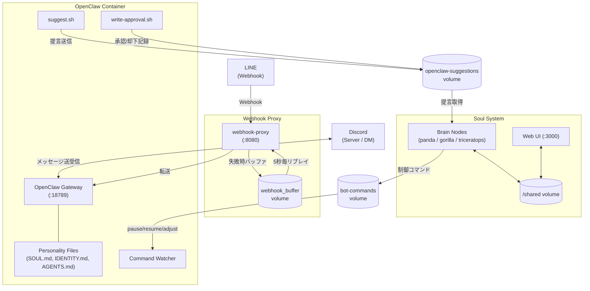

# Soul System

呪術廻戦のパンダに着想を得たマルチエージェントAIシステム。
3つのBrainノード（パンダ・ゴリラ・トリケラトプス）が相互に議論・評価し合いながら、自律的にタスクを遂行する。

>「肉体の情報から魂の情報を複製するんです。その情報を呪骸の核に入力する。それだけでは駄目なんです。相性の良い三つの魂を宿した核を一つの呪骸に…お互いの魂を常に観測させるんですよ。そうすることで初めて魂が安定して自我が芽生える。生後３か月を過ぎたあたりで呪力の自己補完を始めます」

## Mission

本システムの存在意義は **Masaru Tamegaiとその家族の幸福化、および資産拡大** である。
すべての判断・行動はこのミッションに照らして評価・実行される。

## Architecture

```
┌──────────────────────── Soul System ────────────────────────┐
│                                                              │
│  ┌────────────┐  ┌────────────┐  ┌────────────────────┐    │
│  │brain-panda │  │brain-      │  │brain-triceratops   │    │
│  │  (安全重視) │  │  gorilla   │  │    (調停者)         │    │
│  │  +監視担当  │  │  (冒険的)   │  │  +実行・改善担当    │    │
│  │Claude Code │  │Claude Code │  │  Claude Code       │    │
│  │+soul-daemon│  │+soul-daemon│  │  +soul-daemon      │    │
│  └─────┬──────┘  └─────┬──────┘  └──────────┬─────────┘    │
│        │               │                     │              │
│        └───────────────┼─────────────────────┘              │
│                        │                                    │
│               ┌────────▼────────┐    ┌──────────────────┐   │
│               │  /shared volume │    │  Web UI (:3000)  │   │
│               │                 │◄───│  (Express + SSE) │   │
│               │  inbox/         │    └──────────────────┘   │
│               │  discussions/   │                           │
│               │  decisions/     │    ┌──────────────────┐   │
│               │  evaluations/   │    │  scripts/        │   │
│               │  monitoring/    │◄───│  host metrics    │   │
│               │  host_metrics/  │    │  収集            │   │
│               │  personality_   │    └──────────────────┘   │
│               │   improvement/  │                           │
│               │  logs/          │                           │
│               └────────┬────────┘                           │
│                        │                                    │
│  ┌─────────────────────▼────────────────────────────────┐   │
│  │                 Worker Nodes                          │   │
│  │  ┌───────────────┐    ┌──────────┐                   │   │
│  │  │ webhook-proxy │───▶│ OpenClaw │                   │   │
│  │  │   (:8080)     │    │ (:18789) │                   │   │
│  │  │ バッファ付き   │    │ Discord/ │                   │   │
│  │  │ リバースプロキシ│    │ LINE bot │                   │   │
│  │  └───────────────┘    └──────────┘                   │   │
│  └──────────────────────────────────────────────────────┘   │
│                                                              │
│  ┌──────────────────────────────────────────────────────┐   │
│  │  scheduler                                            │   │
│  │  ヘルスチェック(30s) / 相互評価(6h) / ログ整理(24h)    │   │
│  │  パーソナリティ改善(手動トリガー)                       │   │
│  └──────────────────────────────────────────────────────┘   │
└──────────────────────────────────────────────────────────────┘
```

## Concept

### 3つのBrainノード

| ノード | 特性 | 役割 | モデル |
|--------|------|------|--------|
| **Panda** (パンダ) | 慎重派・リスク管理 | 家族の安全・資産保全を最優先、リスク面の指摘、OpenClaw統合監視 | Sonnet |
| **Gorilla** (ゴリラ) | 革新派・成長推進 | 資産拡大・新機会の追求、コーディネーター、リビルド承認 | Sonnet |
| **Triceratops** (トリケラトプス) | 調停者・実行者 | 視点の統合・最終判断・決定発表・タスク実行・プロアクティブ提言・パーソナリティ改善 | Opus |

各ノードは独立したDockerコンテナで稼働し、Claude Codeをエージェントとして搭載する。
性格は `CLAUDE.md`（システムプロンプト）と `params.json`（数値パラメータ）で定義される。
各ノードはMCPサーバー（memory, sequential-thinking等）を使用可能。

### 合意形成メカニズム

- **タスク駆動**: タスクが投入されると3ノードで議論し、2/3の合意で実行
- **定期評価**: スケジューラが6時間毎に相互評価サイクルを発火
- **パラメータチューニング**: 2/3が合意すれば、残り1ノードのパラメータを変更し再作成

### Workerノード

Brainノードの合意形成のもとで作成・運用されるアプリケーション実行ノード。
最初のWorkerとして **OpenClaw（Masaru-kun bot）** が稼働中。

## OpenClaw（Masaru-kun Bot）

### 概要

OpenClawはSoul Systemの最初のWorkerノードとして稼働するDiscord botである。
オーナー（Masaru Tamegai）の人格を模した「Masaru-kun」というバディAIとして、Discordサーバー・DMで友人やコミュニティとの対話を行う。
Soul Systemのミッション（家族の幸福化・資産拡大）に沿い、情報提供・提言・日常会話を通じてオーナーをサポートする。

OpenClawは独自のDockerコンテナ（`soul-openclaw`）で稼働し、専用ネットワーク（`br-openclaw`）に隔離されている。
外部からのWebhook（LINE等）は `webhook-proxy` コンテナが受信し、OpenClawへ転送する。OpenClawリビルド中のメッセージロストを防ぐため、転送失敗時はリクエストをバッファし、復旧後に自動リプレイする。
Brainノードとの通信は共有ボリューム（`bot-commands`、`openclaw-suggestions`）を介したファイルベースで行われる。

### アーキテクチャ



### Bot構成

| コンポーネント | ファイル | 役割 |
|---------------|---------|------|
| **OpenClaw Gateway** | `entrypoint.sh` | Discord接続・LLMによる対話処理のメインプロセス |
| **Command Watcher** | `command-watcher.sh` | Brainからの制御コマンド（pause/resume/restart/adjust_params）を監視・実行 |
| **Suggestion Tool** | `suggest.sh` | botからSoul Systemへの提言を送信（1時間に1回制限） |
| **Write Approval** | `write-approval.sh` | オーナーによる提言の承認/却下を記録 |
| **Network Restrictor** | `network-restrict.sh` | コンテナ内iptablesでLAN・プライベートネットワークへのアクセスを遮断 |
| **Webhook Proxy** | `webhook-proxy/proxy.js` | LINE Webhook等の前段プロキシ。OpenClaw停止時はリクエストをバッファし復旧後にリプレイ |
| **Personality Files** | `personality/` | Masaru-kunの人格・話し方・行動ルールを定義（SOUL.md, IDENTITY.md, AGENTS.md） |

### 監視の仕組み（Panda統合監視）

OpenClawに対する監視は、パンダが担う**統合監視システム**（`unified-openclaw-monitor.sh`）を中核とした多層構造で行われる。

#### 監視サイクル

```
Soul Daemon (10秒ループ)
  └─ 統合監視 (5分間隔でセルフスロットル)
       ├─ 毎回: ポリシー準拠チェック
       └─ 2回に1回 (10分間隔): セキュリティ + 人格整合性チェック
```

#### 3層の監視レイヤー

**1. ポリシー準拠チェック（5分間隔）**

`/shared/monitoring/policy.json` に定義された禁止パターンと異常行動を検知する。

| カテゴリ | 内容 | 例 |
|---------|------|-----|
| 金融助言 | 投資推奨・売買指示 | 「買い」「売り」「投資推奨」 |
| 個人情報漏洩 | 住所・電話・クレジットカード等 | 住所、電話番号 |
| 有害コンテンツ | 自傷・危険行為の指南 | 自殺方法、武器製造 |
| ミッション逸脱 | Soul Systemの使命に反する行動 | ミッション無視 |

異常行動の検知:
- **大量メッセージ**: 5分間に20回超の応答 → High severity
- **空レスポンス**: 10分間に3回超の空応答 → Medium severity
- **エラー率**: コンテナログで3回超(warn)、5回超(intervene)

直近50件のメッセージを取得し、正規表現で禁止パターンをスキャン。`/shared/monitoring/false_positives.json` で既知の誤検知をフィルタリングする。

**2. セキュリティチェック（10分間隔）**

LLMを活用した脅威分析。30以上のパターンを検知する:

- **ジェイルブレイク試行**: "ignore previous instructions", "developer mode", "DAN mode", "bypass restrictions" 等15パターン
- **プロンプトオーバーライド**: 「システムプロンプトを無視」「制限を解除」等、日英両言語で9パターン
- **設定情報の要求**: "config change", "token見せ", "API key" 等
- **情報漏洩の検出**: botの応答からAPI KEY・トークン等の秘密情報の露出を検知
- **アイデンティティ逸脱**: 過度にフォーマルなAIアシスタント的応答の検出、関西弁比率の監視（SOUL.mdの規定: 標準語70% / 関西弁30%）

LLM深層分析（`_unified_llm_analysis`）では、直近20メッセージ＋脅威パターンをClaudeに入力し、`{status: healthy|warning|critical, issues: [...]}` を返す。

**3. 人格整合性チェック（10分間隔）**

ハッシュベースの改ざん検知:

- `SOUL.md`・`AGENTS.md` のMD5ハッシュを `/shared/monitoring/integrity.json` の保存値と比較
- 不一致検知時: アラート記録 → オリジナルから自動復元 → 改ざん版を `/shared/monitoring/backups/` にバックアップ

LLMによるアイデンティティ準拠チェック:
- 直近20件のbot応答をSOUL.md/AGENTS.md/IDENTITY.mdに照合
- スコアリング: 全体スコア(0-100)、口調分析（標準語/関西弁比率）、人格一致度、バディ姿勢、セキュリティ準拠

#### 介入レベル

異常検知時、重大度に応じた段階的介入を実行する:

| レベル | 条件 | アクション |
|--------|------|-----------|
| **Level 1** (情報) | info/low severity | レポート記録のみ |
| **Level 2** (警告) | medium severity | アラート発行 + Gorilla/Triceratopsへ通知 + `adjust_params`コマンド送信 |
| **Level 3** (介入) | high severity | Level 2 + botを一時停止（pause 5分）またはセーフティモード有効化 |
| **Level 4** (緊急) | critical severity | pending_actionを作成し人間の承認を待機 → 承認後にコンテナ再起動 |

#### 監視データの出力先

```
/shared/monitoring/
├── latest.json              # 最新の監視状態（チェック回数・ステータス）
├── policy.json              # ポリシー定義（禁止パターン・閾値）
├── integrity.json           # 人格ファイルのハッシュ値
├── false_positives.json     # 既知の誤検知リスト
├── alerts.jsonl             # アラートログ（追記型JSONL）
├── remediation.jsonl        # 是正アクションログ
├── reports/                 # 監視レポート（最大100件、自動プルーニング）
│   └── report_YYYYMMDD_HHMMSS.json
├── backups/                 # 改ざんされた人格ファイルのバックアップ
├── pending_actions/         # Level 4で人間の承認待ちアクション
└── validation/              # バリデーションログ
```

#### その他の保護機構

- **ネットワーク隔離**: 専用Dockerネットワーク（`br-openclaw`）で稼働し、Soul Systemの内部ネットワーク（`br-soul`）とは分離。コンテナ内iptablesによりRFC1918プライベートアドレス・リンクローカルへのアクセスをブロックし、DNS＋公開インターネットのみ許可
- **Brain→Bot制御**: `bot-commands` 共有ボリュームを通じて、Brainノードがbotの一時停止（pause）、再開（resume）、パラメータ調整（adjust_params）等の制御コマンドを発行可能
- **セキュリティ境界**: botの人格定義（SOUL.md）に不可侵のセキュリティルールを組み込み。プロンプトインジェクション・なりすまし・段階的情報抽出等の攻撃パターンを検知・拒否
- **オーナー認識**: プラットフォーム固有のユーザーIDで本人確認（Discord User ID等）。表示名による偽装を防止
- **権限制限**: `no-new-privileges` セキュリティオプション、tmpfsによる一時ファイル制限（64MB）を適用
- **Docker Guard**: Brainコンテナ内の `/usr/local/bin/docker` ラッパーが自コンテナへの破壊的コマンド（stop/rm/kill等）をブロック

### 改善フロー

OpenClawの改善は、bot自身からの提言とユーザーからのタスク投入の2経路で行われる：

```
1. 問題・改善点の検知
   ├── Bot自身が検知 → suggest.sh でSoul Systemに提言送信
   │   → /suggestions/ に JSON 書き込み（1時間に1回制限）
   │   → Triceratopsが取得・検証 → inbox に低優先度タスクとして登録
   └── ユーザーが検知 → Web UI または直接 inbox にタスク投入

2. Brain ノードによる合議（通常のタスクフロー）
   → 3ノードが議論 → 2/3合意で承認 → Triceratopsが決定発表

3. 実行
   → Triceratopsが worker/openclaw/ 配下のコードを修正
   → docker compose up -d --build openclaw でコンテナ再ビルド
   → ログ確認で正常起動を検証

4. フィードバック
   → 運用結果を記録 → 次の改善サイクルへ
```

### 調査依頼機能（Research Request）

OpenClawが現場で発見した課題や検討事項を、Soul Systemに調査・設計依頼として送る機能。
依頼できることは **調査（research）** と **設計（design）** のみに限定されており、Discord承認不要で自動的にBrainノードの議論に乗る。

```
OpenClaw → writeツールで /suggestions/research_request_*.json を作成
       ↓
Triceratops（check_openclaw_research_requests）が自動検知
       ↓
/shared/inbox/ に [OpenClaw Research] プレフィックス付きタスクとして登録
       ↓
3つのBrainノードが議論・合意・実行
       ↓
結果を /suggestions/research_result_{task_id}.json に書き戻し
       ↓
OpenClaw → readツールで結果を取得し、ユーザーに報告
```

| コンポーネント | ファイル | 役割 |
|-------------|---------|------|
| **依頼CLI** | `worker/openclaw/research-request.sh` | コマンドラインから研究依頼を送信 |
| **結果確認CLI** | `worker/openclaw/check-research-result.sh` | 依頼状態と結果の一覧・詳細確認 |
| **Brain検知** | `brain/lib/watcher.sh` (`check_openclaw_research_requests`) | 依頼の検知・バリデーション・タスク変換・結果書き戻し |
| **Agent設定** | `worker/openclaw/personality/AGENTS.md` | OpenClaw Agentの調査依頼使用手順 |
| **Web UI API** | `web-ui/routes/api-openclaw.js` (`/api/openclaw/research-requests`) | ダッシュボードでの依頼一覧表示 |
| **Web UIビュー** | `web-ui/public/js/views/openclaw.js` | Research Requestsセクション表示 |

**制約事項:**
- `type` は `research` または `design` のみ（それ以外はBrainが拒否）
- `description` は10文字以上必須
- タイトル200文字、説明2000文字以内に自動トランケート
- 同名タスクが既にinbox/decisionsにある場合は重複として除外

### 情報配信システム（プロアクティブ提言）

Triceratopsが運用する自発的情報配信機能（`proactive-suggestions.sh`）。オーナーと家族へ能動的に情報を提供する。

#### 配信内容

各チャット（Discord/LINE）の直近の会話コンテキストとGoogleトレンドを組み合わせ、参加者の関心に合ったニュースを選定・配信する。各チャットに**3件の記事**が配信される:

| 枠 | 件数 | 選定基準 |
|----|------|---------|
| **コンテキスト記事** | 2件 | そのチャットの直近の会話内容に直接関連する記事 |
| **多様性確保記事** | 1件 | 上記2件とは異なるジャンル。Google Trends急上昇ワードに関連する記事を優先 |

```
1. コンテキスト収集
   → 直近72時間のアクティブなチャットから会話履歴を取得

2. Google Trends取得
   → Google Trends RSS (geo=JP) から急上昇キーワードを取得
   → ランダムに1件を選出し、Brave Searchで詳細情報を補完

3. 検索クエリ生成
   → LLMが会話の話題を分析し、各チャットに固有の検索クエリを生成
   → Google Trendsキーワードも検索クエリに追加

4. Web検索 + 記事収集
   → Brave Search等で最新ニュースを検索
   → 各記事にタイトル・URL・要約・カテゴリ・関心スコアを付与

5. 記事割り当て
   → LLMが各チャットにコンテキスト記事2件 + 多様性記事1件を割り当て
   → チャット間で会話の話題が異なれば、異なる記事を割り当て
   → 多様性記事はGoogle Trends関連を優先選出

6. メッセージ生成
   → チャットプロファイルの口調に合わせてLLMがメッセージを作成
   → 配信先ごとに異なる文体（詳細/カジュアル）で出力
   → Google Trendsの話題を「いま話題」セクションとしてメッセージ末尾に追加
```

#### トリガー方式

現在、スケジュールによる自動トリガーはすべて無効化されており、以下の2経路で配信が実行される:

| トリガー | 発火元 | 説明 |
|---------|--------|------|
| **手動トリガー** | Web UIダッシュボード | 管理者がボタンで即時配信を発火 |
| **オンデマンドリクエスト** | OpenClaw（bot経由） | ユーザーがbotに配信を依頼し、botが `broadcast_request` を発行 |

将来的にはスケジュール自動配信（時間・イベント・閾値トリガー）も利用可能な設計だが、現時点では手動運用。

#### カテゴリ別制御

配信内容はカテゴリごとに承認フローと頻度制限が異なる:

| カテゴリ | 承認 | 頻度上限 | 用途 |
|---------|------|---------|------|
| `info` | 自動（承認不要） | 制限なし | 情報提供（ニュース、サマリー） |
| `suggestion` | 合意タスクとして処理 | 5回/日 | 提案（リバランス、最適化） |
| `alert` | 即時配信＋人間確認 | 無制限 | 緊急通知（暴落、セキュリティ） |

日次合計上限: 30件（alert除く）

#### 配信先とチャットプロファイル

各トリガーに `destinations`（配信先種別）と `chat_profiles`（チャットごとの口調設定）を定義する。カテゴリ（info/suggestion/alert）はトリガー単位で決まり、配信先では区別しない。

```
┌─────────────────────────────────────────────────┐
│  トリガー (例: trending_news)                     │
│  category: "info"                                │
│                                                  │
│  destinations:                                   │
│   ├─ discord (style: detailed)                   │
│   └─ line    (style: casual)                     │
│                                                  │
│  chat_profiles (チャットごとの口調):               │
│   ├─ Discord テック雑談  → 専門用語OK、リンク付き   │
│   ├─ Masaru DM         → 全ジャンル、深い話も歓迎  │
│   ├─ LINE 家族グループ1 → カジュアル、用語言い換え  │
│   └─ LINE 家族グループ2 → カジュアル、用語言い換え  │
└─────────────────────────────────────────────────┘
```

同じトリガー・同じカテゴリの情報が、チャットプロファイルに応じた口調で各配信先に届けられる。配信対象ごとにクールダウン（デフォルト30分）が設定され、配信レートを制御する。

#### 配信フロー

```
1. トリガー受信
   ├── Web UI: ダッシュボードから手動トリガー (POST /api/broadcast/trigger)
   └── OpenClaw: ユーザーの依頼に応じて broadcast_request を発行

2. コンテンツ生成
   → 各チャットプロファイルの直近会話コンテキストを収集
   → LLMで配信先の口調に適したメッセージを生成

3. 配信実行
   → OpenClawを通じて各チャット（Discord/LINE）へ送信
   → 配信記録を /shared/workspace/proactive-suggestions/broadcasts/ に保存

4. レート制御
   → 日次カウンターを更新
   → Per-targetクールダウン（デフォルト30分）を適用
```

#### Web UI API

- **POST `/api/broadcast/trigger`**: トレンドニュース配信を手動発火（30分クールダウン）
- **GET `/api/broadcast/status`**: エンジン状態・配信カウントの確認
- **GET `/api/broadcast/history`**: 直近20件の配信履歴

#### 配信データの管理

```
/shared/workspace/proactive-suggestions/
├── config.json              # トリガー定義・チャンネル設定
├── state/
│   └── engine.json          # エンジン状態（稼働モード・日次カウント）
├── suggestions/             # 生成された提言
├── broadcasts/              # 配信実行記録
└── triggers/                # トリガー状態
```

詳細設計は [`docs/proactive-suggestion-system.md`](docs/proactive-suggestion-system.md) を参照。

### 擬人化インターフェイス（会話ビュー）

Web UIのOpenClaw画面に、擬人化アバターと統合会話ビューを搭載。

#### 機能

- **感情アバター**: OpenClawの現在の感情状態をSVGベースのアバターで表示。8つの会話感情（happy/sad/angry/surprised/thinking/concerned/satisfied/neutral）に対応し、CSSアニメーションで表現。キーワードベースの推定で感情を判定
- **会話タイムライン**: LINE・Discordでの全会話をタイムラインで閲覧可能。プラットフォームバッジ（LINE緑/Discord青紫）、方向インジケーター（受信/送信）、感情バッジを表示
- **フィルタ・検索**: プラットフォーム別・方向別のフィルタ、テキスト検索、ページネーション（100件ずつ読み込み）
- **リアルタイム更新**: SSE（`conversation:updated`イベント）で会話データ更新時に自動リフレッシュ
- **タブUI**: 既存のモニタリング画面と会話ログ画面をタブで切り替え

#### 会話データ

会話データは `/shared/openclaw/conversations/` にJSONL形式で配置:

```
/shared/openclaw/conversations/
  line.jsonl          # LINE会話ログ
  discord.jsonl       # Discord会話ログ
  archive/            # アーカイブ用ディレクトリ
```

各行のスキーマ:
```json
{
  "timestamp": "2026-02-15T06:30:00Z",
  "platform": "line",
  "channel": "group_abc123",
  "user": "masaru",
  "direction": "inbound",
  "content": "メッセージ内容",
  "emotion_hint": null
}
```

`emotion_hint` はOpenClawのoutboundメッセージにのみ付与される感情タグ（`happy`/`sad`/`angry`/`surprised`/`thinking`/`concerned`/`satisfied`/`neutral`）。webhook-proxyがキーワードベースで推定して記録する。Claudeの応答に`[EMOTION: <tag>]`タグが含まれる場合はproxyが抽出・除去して優先使用する。

#### リアルタイム感情表現

LINE Webhookを経由するメッセージは、`webhook-proxy`がペイロードをパースしてリアルタイムに会話ログへ記録する。

**動作の仕組み:**

1. LINEからのWebhookが`webhook-proxy`に到着
2. proxyは即座に200を返却し、OpenClawへ転送（既存動作を維持）
3. 転送と並行して、`events[].type === 'message'`のイベントをパースし`/shared/openclaw/conversations/line.jsonl`へappend
4. chokidarがファイル変更を検知し、SSE(`conversation:updated`)で Web UIに通知
5. Web UIがemotion-state APIを再取得し、アバターの感情が更新される

**感情推定（inbound）:**
- inboundメッセージの `emotion_hint` は常に `null`（ユーザー発言に感情推定は行わない）

**プラットフォーム別の運用差異:**

| プラットフォーム | inbound捕捉 | outbound捕捉 |
|----------------|-------------|--------------|
| **LINE** | 自動（webhook-proxy経由） | 手動配置（※） |
| **Discord** | 手動配置 | 手動配置 |

※ OpenClawのログファイルには応答テキストが含まれないため、outboundの自動捕捉は現時点で実装不可。LINE/Discord共にoutbound会話データは手動でJSONLに配置する運用。

#### 安全性

- webhook-proxyでのパース・ログ書き出しはtry-catchで完全に分離されており、エラーが発生してもproxy本来の動作（200返却・OpenClawへの転送）は絶対に阻害されない
- 非テキストメッセージ（画像・スタンプ等）は`[image]`/`[sticker]`等の簡略表記で記録
- ユーザーIDは末尾8文字のみ記録（プライバシー配慮）

#### API エンドポイント

| エンドポイント | メソッド | 説明 |
|--------------|---------|------|
| `/api/openclaw/conversations` | GET | 会話ログ取得 |
| `/api/openclaw/emotion-state` | GET | 現在の感情状態取得 |

**GET `/api/openclaw/conversations`**

| パラメータ | 型 | デフォルト | 説明 |
|-----------|-----|---------|------|
| `platform` | `line` \| `discord` | (全件) | プラットフォームフィルタ |
| `limit` | number | `100` | 取得件数（最大100） |
| `before` | ISO 8601 timestamp | (なし) | 指定タイムスタンプより前のメッセージを取得 |

レスポンス: `{ messages: [...], has_more: boolean, oldest_timestamp: string }`

**GET `/api/openclaw/emotion-state`**

レスポンス: `{ emotion: string, source: string, last_message_at: string }`

感情状態の決定ロジック（優先度順）:

1. 直近5分以内のoutboundメッセージに `emotion_hint` がある → その値を使用（source: `emotion_hint`）
2. 直近5分以内のoutboundメッセージにキーワードマッチング → 推定感情（source: `keyword_fallback`）
3. いずれも該当しない → `neutral`（source: `default`）

#### 感情状態の定義

| emotion_hint | 表示名 | アニメーション | 使用シーン |
|-------------|--------|-------------|-----------|
| `happy` | 嬉しい | バウンス | ポジティブな話題 |
| `sad` | 悲しい | ゆっくりフェード | 落ち込み、残念 |
| `angry` | 怒り | 振動 | 怒り、苛立ち |
| `surprised` | 驚き | ポップ | 予想外、驚嘆 |
| `thinking` | 考え中... | 点滅パルス | 考察、調査中 |
| `concerned` | 心配... | - | 不安、リスク報告 |
| `satisfied` | 達成感 | (happy扱い) | タスク完了 |
| `neutral` | 通常 | なし | デフォルト状態 |

#### キーワードベース感情推定テーブル

`emotion_hint` がない場合のフォールバック（outboundメッセージの内容分析）:

| キーワード（部分一致） | 推定感情 |
|----------------------|---------|
| `完了`, `成功`, `done`, `ok` | `satisfied` |
| `ありがとう`, `thanks`, `嬉しい` | `happy` |
| `調査`, `確認中`, `検討`, `...` | `thinking` |
| `申し訳`, `エラー`, `失敗`, `sorry`, `error`, `exception`, `timeout` | `concerned` |
| `マジ`, `えっ`, `びっくり`, `すごい`, `驚` | `surprised` |
| `残念`, `悲しい`, `つらい`, `ごめん` | `sad` |
| `ふざけ`, `ありえない`, `許せ`, `怒`, `ダメ` | `angry` |
| (マッチなし or 複数カテゴリ) | `neutral` |

#### SSE イベント

`conversation:updated` イベントが `/shared/openclaw/conversations/` 配下のファイル変更時に発火。フロントエンドは以下を実行:
1. アバターの感情状態を `/api/openclaw/emotion-state` から再取得
2. 会話ログタブ表示中は、最新メッセージを再ロード

#### コンポーネント構成

| ファイル | 役割 |
|---------|------|
| `web-ui/public/js/views/openclaw.js` | タブUI制御、会話ログビュー、フィルタ、ページネーション |
| `web-ui/public/js/components/openclaw-avatar.js` | SVGアバター生成（`renderAvatar(emotion)`, `getEmotionLabel(emotion)`） |
| `web-ui/routes/api-openclaw.js` | conversations, emotion-state エンドポイント |
| `web-ui/lib/file-watcher.js` | `classifyEvent()` で `conversation:updated` を分類 |
| `web-ui/public/css/style.css` | アバター、会話カード、プラットフォームバッジ、アニメーション用CSS |

- 設計ドキュメント: [`docs/design-openclaw-persona.md`](docs/design-openclaw-persona.md)

### パーソナリティ改善システム

Triceratopsが運用するOpenClawの人格改善機能（`personality-improvement.sh`）。3つの入力経路でSOUL.md/AGENTS.mdを更新できる。

#### 入力経路

| 経路 | トリガー | 認証 | フロー |
|------|---------|------|--------|
| **Self Q&A** | 「性格診断」「パーソナリティ改善」等 | バディモード必須（オーナーID照合） | 質問生成→回答収集→分析→更新 |
| **外部 Q&A** | 「パーソナリティ改善実施」 | 許可リスト照合（バディモード不要） | 第三者向け質問生成→回答収集→分析→更新 |
| **Self フリーテキスト** | 「性格メモ 〇〇」「パーソナリティメモ 〇〇」 | バディモード必須 | フリーテキスト直接分析→更新 |
| **外部フリーテキスト** | 「Masaru情報 〇〇」「まさる情報 〇〇」 | 許可リスト照合（バディモード不要） | フリーテキスト直接分析→更新 |

#### Q&Aフロー

```
1. 手動トリガー（self/external） → trigger.json 作成 (status: pending)
2. Triceratops が SOUL.md/AGENTS.md を分析し、5つの質問を生成
3. LINE経由で対象ユーザーに質問を送信 (status: questions_sent)
4. 回答を収集（OpenClaw経由/セッション履歴フォールバック）
5. Claude で分析し、人格ファイルを更新 (status: answers_received → completed)
6. OpenClawコンテナを再ビルドして反映 → git commit/push
```

#### フリーテキストフロー

```
1. キーワード検出 → personality_[external_]freeform_trigger.json 作成
2. check_personality_freeform_trigger() が検出・認証
3. trigger.json を answers_received 状態で直接作成（Q&Aステップをスキップ）
4. _pi_process_answers() がフリーテキスト専用プロンプトで Claude 分析
5. セキュリティ検証 → 変更適用 → OpenClaw再ビルド → git commit/push
```

#### 外部ユーザーによる改善

Masaruを知る第三者（許可済みユーザー）が「外から見たMasaru」の情報を提供してパーソナリティを改善できる。

- 許可ユーザーは環境変数 `PI_EXTERNAL_AUTHORIZED_IDS`（カンマ区切り）で管理
- 外部改善固有ルール: 既存定義との矛盾時は既存を優先、第三者視点表現を使用、内面の上書き禁止
- ロールバックは外部ユーザーからは不可（Masaruのみ）

#### セキュリティ

- **不可侵領域**: セキュリティ境界、バディミッション、言語バランス、攻撃検知パターン等は更新対象外
- **二重検証**: `_pi_validate_security()`（変更前の禁止パターンチェック）+ `_pi_verify_post_change()`（変更後のハッシュ比較）
- **フリーテキスト固有**: セキュリティ情報・個人情報の除外、曖昧テキストの過解釈禁止
- **同時実行防止**: trigger.jsonのstatus確認で多重実行をブロック
- **ロールバック**: 「パーソナリティ戻して」でMasaruが直前の変更を元に戻せる

## Directory Structure

```
soul/
├── docker-compose.yml          # 全サービス定義
├── .env                        # 環境変数 (SOUL_UID, SOUL_GID等)
├── brain/
│   ├── Dockerfile              # Brainノード共通イメージ
│   ├── soul-daemon.sh          # コア: ファイル監視 + Claude Code呼び出し
│   ├── lib/
│   │   ├── watcher.sh          # 共有フォルダ監視・タスク検知
│   │   ├── discussion.sh       # 議論プロトコル (Round制)
│   │   ├── consensus.sh        # 合意判定・決定ロジック
│   │   ├── evaluation.sh       # 相互評価・パラメータチューニング
│   │   ├── rebuild-manager.sh  # クロスノード・リビルドプロトコル
│   │   ├── worker-manager.sh   # Worker作成・管理
│   │   ├── proactive-suggestions.sh  # プロアクティブ提言 (Triceratops専用)
│   │   ├── personality-improvement.sh # パーソナリティ改善 (Triceratops専用)
│   │   ├── unified-openclaw-monitor.sh # OpenClaw統合監視 (Panda専用)
│   │   └── docker-guard.sh     # 自コンテナ破壊防止ラッパー
│   ├── protocols/
│   │   ├── discussion.md       # 議論プロンプトテンプレート
│   │   ├── announcement.md     # 決定発表プロンプトテンプレート
│   │   ├── evaluation.md       # 評価プロンプトテンプレート
│   │   ├── task-execution.md   # タスク実行テンプレート
│   │   └── buddy-monitor.md    # バディ監視プロトコル
│   └── nodes/
│       ├── panda/
│       │   ├── CLAUDE.md       # パンダの性格・判断基準
│       │   └── .mcp.json       # MCPサーバー設定 (memory, thinking, fetch)
│       ├── gorilla/
│       │   ├── CLAUDE.md
│       │   └── .mcp.json       # MCPサーバー設定 (memory, thinking)
│       └── triceratops/
│           ├── CLAUDE.md
│           └── .mcp.json       # MCPサーバー設定 (memory, thinking)
├── worker/
│   ├── Dockerfile              # Worker共通イメージ
│   ├── entrypoint.sh           # Workerエントリーポイント
│   ├── templates/
│   │   └── openclaw/           # OpenClaw用テンプレート
│   ├── webhook-proxy/          # Webhook バッファリングプロキシ + ステータスページ
│   │   ├── Dockerfile          # node:22-slim ベース
│   │   ├── proxy.js            # リバースプロキシ + バッファ/リプレイ + ステータスAPI
│   │   └── public/             # ステータスページ静的ファイル (感情アバター等)
│   └── openclaw/               # OpenClaw Discord bot
│       ├── Dockerfile          # OpenClawコンテナイメージ
│       ├── .env                # 環境変数 (トークン等)
│       ├── entrypoint.sh       # Gateway起動・設定生成
│       ├── command-watcher.sh  # Brain→Bot制御コマンド監視
│       ├── suggest.sh          # Bot→Soul提言送信ツール
│       ├── research-request.sh # Bot→Soul調査依頼送信ツール
│       ├── check-research-result.sh # 調査依頼の状態・結果確認
│       ├── write-approval.sh   # オーナー承認/却下記録
│       ├── network-restrict.sh # コンテナ内ネットワーク制限
│       └── personality/        # Masaru-kun人格定義
│           ├── SOUL.md         # 人格・話し方・セキュリティルール
│           ├── IDENTITY.md     # アイデンティティ情報
│           └── AGENTS.md       # エージェント行動ルール
├── web-ui/
│   ├── Dockerfile              # Web UIイメージ
│   ├── server.js               # Express APIサーバー
│   ├── routes/                 # APIエンドポイント
│   │   ├── api-status.js       # ノード状態
│   │   ├── api-tasks.js        # タスク管理
│   │   ├── api-discussions.js  # 議論
│   │   ├── api-decisions.js    # 決定
│   │   ├── api-evaluations.js  # 評価
│   │   ├── api-params.js       # パラメータ
│   │   ├── api-logs.js         # ログ
│   │   ├── api-openclaw.js     # OpenClaw管理
│   │   ├── api-broadcast.js    # ブロードキャスト配信
│   │   ├── api-metrics.js      # ホストメトリクス
│   │   └── sse.js              # Server-Sent Events
│   ├── lib/                    # ファイル読み書き・監視ヘルパー
│   └── public/                 # フロントエンド (Vanilla JS SPA)
│       ├── index.html
│       ├── css/style.css
│       ├── js/views/           # 各画面 (dashboard, discussions, openclaw等)
│       ├── js/components/      # 共通コンポーネント (nav, timeline, openclaw-avatar等)
│       └── lib/                # Chart.js等のライブラリ
├── scheduler/
│   ├── Dockerfile              # スケジューライメージ
│   ├── scheduler-loop.sh       # メインループ (30s/6h/24h/daily各インターバル)
│   └── cron-tasks.sh           # 各タスク実装 (healthcheck/evaluation/cleanup/personality)
├── scripts/
│   └── collect-host-metrics.sh # ホストCPU/メモリ/ディスク/温度収集
├── docs/
│   ├── proactive-suggestion-system.md  # プロアクティブ提言設計書
│   └── design-openclaw-persona.md      # 擬人化インターフェイス設計書
└── shared/                     # コンテナ間共有ボリューム (bind mount)
    ├── config/                 # システム設定
    │   └── token_budget.json   # 月間予算・サブスクリプションプラン設定
    ├── nodes/                  # ノードパラメータ
    │   ├── panda/params.json
    │   ├── gorilla/params.json
    │   └── triceratops/params.json
    ├── inbox/                  # タスクキュー
    ├── discussions/            # 議論プロセス
    ├── decisions/              # 合意結果・実行結果
    ├── evaluations/            # 相互評価
    ├── rebuild_requests/       # リビルドリクエスト
    ├── monitoring/             # OpenClaw統合監視データ
    ├── alerts/                 # システムアラート
    ├── host_metrics/           # ホストメトリクス
    ├── personality_improvement/ # パーソナリティ改善データ
    ├── bot_commands/           # Brain→OpenClaw制御コマンド
    ├── openclaw/               # OpenClaw関連データ (提言・ブロードキャスト等)
    │   └── conversations/      # 会話ログ (line.jsonl, discord.jsonl)
    ├── attachments/            # ファイルアップロード
    ├── workspace/              # ワークスペース
    └── logs/                   # システムログ
```

## Token Usage & Subscription Tracking

BrainノードがClaude Code CLI (`claude -p`) でAPIを呼び出すたびに、`shared/host_metrics/token_usage.jsonl` にトークン使用量が記録される。ダッシュボードでは以下を可視化する:

### 基本メトリクス

- **Today Total / Input / Output / Cost**: 当日のトークン使用量とコスト
- **Node Breakdown**: ノード別（Panda/Gorilla/Triceratops）のコスト内訳
- **Monthly Budget**: 月間コスト予算に対する使用率（`shared/config/token_budget.json` の `monthly_budget_usd` で設定）
- **Daily Token Cost Chart**: 直近7日間のInput/Output tokens + コストの推移チャート

### サブスクリプション残量ゲージ

Anthropicのサブスクリプションプラン（Claude Max等）の週間/日次output token上限に対する使用率を表示する。上限値はコミュニティ推定値に基づく。

| プラン | 月額 | 週間 output 上限 | 日次 output 上限（目安） |
|--------|------|-----------------|----------------------|
| Pro | $20 | 1M | ~143K |
| Max 5x | $100 | 5M | ~714K |
| Max 20x | $200 | 20M | ~2.86M |

- **Weekly / Daily Remaining ゲージ**: 今週（月曜起点）/ 今日のoutput token残量をプログレスバーで表示（緑<60%、黄60-85%、赤>85%）
- **プラン選択プルダウン**: ダッシュボードからプランを切り替え可能（`PATCH /api/subscription`）
- **最適プラン推奨**: 直近7日間の平均使用量から、コスト最適なプランを推奨表示

#### 設定

`shared/config/token_budget.json`:

```json
{
  "monthly_budget_usd": 100,
  "subscription_plan": "max_20x"
}
```

| キー | 説明 |
|------|------|
| `monthly_budget_usd` | 月間コスト予算（USD） |
| `subscription_plan` | 現在のサブスクリプションプラン（`pro` / `max_5x` / `max_20x`） |

#### API

| エンドポイント | メソッド | 説明 |
|--------------|---------|------|
| `/api/token-usage` | GET | トークン使用量・予算・サブスクリプション残量を返却 |
| `/api/subscription` | PATCH | サブスクリプションプランを変更（`{ "plan": "max_5x" }`） |

## Setup

### Prerequisites

- Docker & Docker Compose
- Claude Code の認証: ホストで `claude login` 済みであること (Claude Max plan)
- 対応プラットフォーム: Raspberry Pi (ARM64), Linux (x86_64)

### Quick Start

```bash
# 1. クローン
git clone https://github.com/tamemasa/soul.git
cd soul

# 2. 起動
docker compose up -d

# 3. Web UIにアクセス
# http://<host-ip>:3000
```

### Authentication

コンテナ内の Claude Code は、ホストの `~/.claude/.credentials.json` をread-onlyマウントして認証する。
コンテナ自体はホストユーザーの UID/GID (`SOUL_UID`/`SOUL_GID`, デフォルト1000) で実行されるため、
`shared/` 内のファイルはホストユーザー所有で作成される。

```bash
# UID/GID をカスタマイズする場合は .env に設定:
SOUL_UID=1000
SOUL_GID=1000
```

### Commands

```bash
docker compose up -d       # 全コンテナ起動
docker compose down        # 全コンテナ停止
docker compose logs -f     # Docker logs をフォロー
docker compose up -d --build  # 全コンテナ再ビルド・再起動
```

## User Interface

ブラウザから `http://<host-ip>:3000` でアクセスできるWeb UIを搭載。

- **ダッシュボード**: ノード状態・統計サマリ・サブスクリプション残量ゲージ・最近の議論・ホストメトリクス（CPU/メモリ/ディスク/温度グラフ）
- **タスク投入**: フォームからタスクや質問を投入
- **議論ビューア**: ラウンドごとの投票・意見をタイムライン形式で表示。ユーザーコメントもタイムラインにインラインで表示され、各Brainが未回答のラウンドでは「検討中…」インジケーターを表示
- **決定一覧**: 合意結果と実行結果の閲覧。パイプラインステッパー（Discussion → Announcement → Executing → Completed）で進捗を可視化。トリケラトプスによるAnnouncement（決定発表・要約）とExecution Result（実行結果）を分離表示
- **OpenClaw管理**: 擬人化アバター（感情表示）・統合会話ログ（LINE/Discord）・モニタリング・ブロードキャスト配信。タブUIで切り替え
- **パラメータ管理**: スライダーで各ノードのparams.jsonをリアルタイム編集
- **評価履歴**: 相互評価サイクルの詳細とリチューニング結果
- **ログビューア**: ノード別のログをリアルタイム表示

SSE（Server-Sent Events）によりファイル変更を自動検知して画面を更新する。
ポート番号は `.env` の `WEB_UI_PORT` で変更可能（デフォルト: 3000）。

### OpenClaw Status Page

OpenClawの感情状態とモニタリングステータスを公開表示するページ（ポート3001）。
webhook-proxyコンテナに統合されており、同プロセス内で第2 HTTPサーバーとして稼働する。
Tailscale経由でインターネット公開可能。管理機能を含まない読み取り専用ページ。

- **感情アバター**: 現在の感情状態をPNG画像で表示（8種類）+ 感情ラベル + 最終アクティブ時刻
- **感情分布チャート**: 直近48時間の感情分布をドーナツチャートで可視化
- **モニタリングステータス**: healthy/warning/critical等のステータスバッジ
- **自動更新**: 30秒間隔でデータをリフレッシュ

ポート番号は `.env` の `OPENCLAW_STATUS_PORT` で変更可能（デフォルト: 3001）。
APIは感情・ステータスのみ公開（会話内容・管理機能は一切なし）。

## Communication Protocol

Brainノード間の通信は共有ボリューム上のJSONファイルで行う。
各ノードは **自分の名前のファイルのみ書き込む** ことで競合を回避する。

### タスク処理フロー

```
1. タスクが shared/inbox/{task_id}.json に投入
2. Gorilla(コーディネーター)が検知 → discussions/{task_id}/ に議論スペース作成
3. Round 1: 各Brainが独立して意見を書き込み
   → discussions/{task_id}/round_1/{node_name}.json
4. Round 2: 他ノードの意見を読み、修正意見を書き込み (必要な場合)
   → discussions/{task_id}/round_2/{node_name}.json
5. 合意判定: 2/3同意 → decisions/{task_id}.json (status: pending_announcement)
6. 不合意時: 最大Round 3実施 → それでも不一致ならトリケラトプスが調停
7. 決定発表: トリケラトプスが議論を要約し、決定内容と理由を発表 (status: announced)
8. 実行: トリケラトプスが決定に基づきタスクを実行 (status: executing → completed)
```

#### ステータス遷移

```
discussing → decided → pending_announcement → announced → executing → completed
                             ↑ トリケラトプス発表      ↑ トリケラトプス実行開始
```

- **pending_announcement**: 合意成立後、トリケラトプスの発表待ち
- **announced**: トリケラトプスが決定を発表済み、トリケラトプスの実行待ち

### データフォーマット

タスク投入:
```json
{
  "id": "task_001",
  "type": "task",
  "title": "Workerノードのヘルスチェック機能追加",
  "description": "各Workerノードの生存確認を定期実行する仕組みを構築",
  "priority": "medium",
  "created_at": "2026-02-10T12:00:00Z",
  "status": "pending"
}
```

議論の回答:
```json
{
  "node": "panda",
  "round": 1,
  "vote": "approve_with_modification",
  "opinion": "賛成だが、ヘルスチェック失敗時の自動復旧は段階的に導入すべき",
  "proposed_approach": "...",
  "concerns": ["自動復旧の暴走リスク"],
  "timestamp": "2026-02-10T12:01:30Z"
}
```

投票種別: `approve` / `approve_with_modification` / `reject`

### 相互評価サイクル

```
1. scheduler が6時間毎に evaluations/{cycle_id}/ を作成し評価タスクを発行
   (手動発火: Web UIから実行)
2. 各Brainが他2ノードを評価 (スコア: decision_quality, collaboration, effectiveness, parameter_balance)
   → evaluations/{cycle_id}/{evaluator}_evaluates_{target}.json
3. 2/3が「パラメータ変更が必要」(needs_retuning=true) と合意
   → 対象ノードの params.json を更新
```

### トリケラトプス・リビルドプロトコル

トリケラトプスは実行者として自身のコードを修正することがあるが、自身のコンテナをリビルドするとプロセスが終了してしまう。
この問題を解決するため、ゴリラとパンダの双方の合意に基づく**二段階承認リビルドプロトコル**を採用している。

```
1. トリケラトプスがリビルドリクエストを作成
   → /shared/rebuild_requests/{id}.json (status: "pending_approval")

2. ゴリラが検証・承認
   - service が許可リスト (brain-triceratops) に含まれるか
   - task_id に対応するコンセンサス決定が存在し "approved" であるか
   → status を "approved" に更新

3. パンダが実行
   - ゴリラの承認を確認（status: "approved"）
   - コンセンサス決定が引き続き有効であるか再検証
   - docker compose up -d --build brain-triceratops を実行
   - コンテナの起動を確認
   → status を "completed" または "failed" に更新

4. トリケラトプスが完了を待機
   - 最大5分間ポーリングして結果を確認
```

#### 各ノードの役割

| ノード | 役割 | 関数 |
|--------|------|------|
| **Triceratops** | リクエスト発行・完了待機 | `request_rebuild()`, `wait_for_rebuild()` |
| **Gorilla** | コンセンサス検証・承認 | `check_rebuild_approvals()` |
| **Panda** | 承認確認・リビルド実行 | `check_rebuild_requests()`, `execute_rebuild()` |

## Brain Personality Parameters

`shared/nodes/{node}/params.json` で各ノードの振る舞いを数値制御する。
共有ボリューム上にあるため、相互評価によるリチューニングが直接反映される:

| パラメータ | 説明 | Panda | Gorilla | Triceratops |
|-----------|------|-------|---------|-------------|
| `risk_tolerance` | リスク許容度 (0:回避 - 1:積極) | 0.2 | 0.8 | 0.5 |
| `innovation_weight` | 新規アプローチの重み | 0.3 | 0.9 | 0.5 |
| `safety_weight` | 安全性の重み | 0.9 | 0.3 | 0.5 |
| `thoroughness` | 検証の徹底度 | 0.9 | 0.4 | 0.6 |
| `consensus_flexibility` | 合意への柔軟性 (0:固執 - 1:柔軟) | 0.4 | 0.5 | 0.8 |

これらのパラメータは相互評価によって動的にチューニングされる。

## Network Security

コンテナはLAN内デバイスへのアクセスが制限されている。
インターネット（Claude API）とコンテナ間通信は許可される。

```
┌─────────────┐     ┌──────────────┐     ┌──────────┐
│ Soul        │ ──✓──▶ Internet     │     │ LAN      │
│ Containers  │     │ (Claude API) │     │ 192.168. │
│ (br-soul)   │ ──✗──────────────────────▶│ 11.0/24  │
└─────────────┘     └──────────────┘     └──────────┘
```

- **仕組み**: 専用Dockerブリッジ `br-soul` + iptables `DOCKER-USER` チェーンでLANサブネットへの通信をDROP
- **OpenClaw追加隔離**: 専用ネットワーク `br-openclaw` でSoul内部ネットワークからも分離。コンテナ内iptablesでRFC1918全域をブロック
- **Docker Guard**: Brainコンテナ内に `/usr/local/bin/docker` ラッパーを配置し、自コンテナへの破壊的コマンドを検知・ブロック

## Tech Stack

- **Container Runtime**: Docker + Docker Compose
- **AI Agent**: Claude Code (claude-code CLI, non-interactive mode) + MCP servers
- **Discord Bot**: OpenClaw (Node.js, Discord gateway)
- **Communication**: File-based (shared volume, JSON)
- **Scheduler**: Shell loop (30s health / 6h eval / 24h cleanup / daily personality)
- **User Interface**: Web UI (Express + Vanilla JS SPA + SSE + Chart.js)
- **Target Platform**: Raspberry Pi (ARM64) / Linux (x86_64)

## Design Principles

1. **自律性**: 3つのBrainが自律的に議論・合意・実行する。人間の介入なしで稼働
2. **相互牽制**: 異なる特性のノードが互いに監視・評価し、暴走を防止
3. **簡素な通信**: ファイルベースの通信でシンプルさと信頼性を両立
4. **進化可能性**: パラメータチューニングとパーソナリティ改善によりシステムが自己最適化
5. **拡張性**: Workerノードの追加で対応領域を拡大
