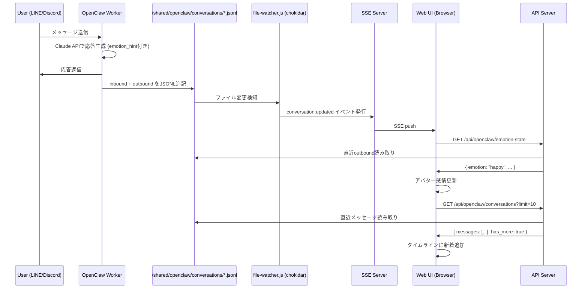
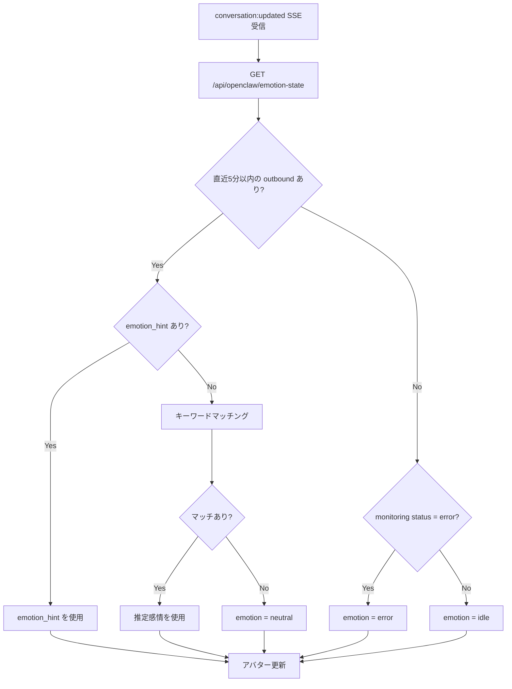

# OpenClaw Persona Interface - Design Document

> Task: `task_1771136278_2097`
> Created: 2026-02-15
> Status: Design Only (実装は別タスク)

---

## 1. Overview

OpenClawモニター画面に擬人化インターフェイスを追加する。
LINEやDiscordでの全会話をタイムライン形式で閲覧可能にし、
OpenClawの感情状態をアバターアニメーションで可視化する。

### Design Principles

- 既存技術スタック（Vanilla JS ES modules + plain CSS + SSE）の範囲内
- 新規フレームワーク・ライブラリの導入なし
- 既存のCSS変数・ダークテーマ・カードレイアウトとの統合
- 認証機構はスコープ外（Docker network内アクセス前提）

---

## 2. 会話データストレージ設計

### 2.1 ディレクトリ構造

```
/shared/openclaw/conversations/
  line.jsonl          # LINE会話ログ（アクティブ）
  discord.jsonl       # Discord会話ログ（アクティブ）
  archive/
    YYYY-MM-DD/
      line.jsonl      # アーカイブ済みLINEログ
      discord.jsonl   # アーカイブ済みDiscordログ
```

### 2.2 メッセージスキーマ

各JSONLファイルの1行 = 1メッセージ:

```json
{
  "timestamp": "2026-02-15T06:30:00Z",
  "platform": "line",
  "channel": "group_abc123",
  "user": "masaru",
  "direction": "inbound",
  "content": "今日の天気はどう？",
  "emotion_hint": "neutral"
}
```

| Field | Type | Description |
|-------|------|-------------|
| `timestamp` | string (ISO 8601 UTC) | メッセージの送受信時刻 |
| `platform` | `"line"` \| `"discord"` | プラットフォーム識別子 |
| `channel` | string | チャンネル/グループID（LINEグループID、Discordチャンネル名等） |
| `user` | string | 送信者名。`"openclaw"` = bot自身の発言 |
| `direction` | `"inbound"` \| `"outbound"` | `inbound` = ユーザーからbot宛、`outbound` = botからユーザー宛 |
| `content` | string | メッセージ本文（テキストのみ。画像等は `[画像]` のようなプレースホルダー） |
| `emotion_hint` | string | OpenClawが応答生成時に自己申告する感情タグ |

### 2.3 `emotion_hint` 定義

OpenClawが応答を生成する際、自分の感情状態を自己申告するタグ:

| Tag | Description | 使用シーン例 |
|-----|-------------|-------------|
| `happy` | 嬉しい・楽しい | ポジティブな話題、褒められた時 |
| `thinking` | 考え中・調査中 | 複雑な質問への回答中 |
| `concerned` | 心配・不安 | エラー報告、リスク検出時 |
| `neutral` | 通常・平静 | 一般的な応答 |
| `satisfied` | 満足・達成感 | タスク完了報告 |
| `error` | エラー・困惑 | 処理失敗、理解不能な入力 |

`inbound` メッセージ（ユーザー発言）の `emotion_hint` は常に `null` または省略する。

### 2.4 ローテーションポリシー

- **保持期間**: アクティブファイルには直近7日分のログを保持
- **アーカイブタイミング**: 日次（cron等で）、7日以上前のエントリを `archive/YYYY-MM-DD/` に移動
- **ファイルサイズ上限**: アクティブファイルは最大 10MB。超過時は古いエントリからアーカイブ
- **アーカイブ保持**: 90日間。90日以上前のアーカイブは自動削除

### 2.5 Worker側変更ガイドライン

OpenClaw Workerで会話JSONLを書き出す際の実装指針:

```
# 書き出しフロー（擬似コード）:

1. メッセージ受信時 (inbound):
   - JSONLエントリを構築 (emotion_hint = null)
   - 対象プラットフォームのJSONLファイルに追記

2. 応答生成時 (outbound):
   - Claude API呼び出し時に、応答JSONに emotion_hint フィールドを含めるよう指示
   - JSONLエントリを構築 (emotion_hint = Claudeの自己申告値)
   - 対象プラットフォームのJSONLファイルに追記

3. 書き込み方法:
   - fs.appendFileSync() で追記（アトミック性は不要、追記のみ）
   - 改行区切りで1行1JSON
```

Worker側で `emotion_hint` をClaudeに自己申告させるプロンプト例:

```
あなたの応答の最後に、以下の形式で感情タグを付与してください:
[EMOTION: happy|thinking|concerned|neutral|satisfied|error]
この行は応答から除去され、メタデータとして記録されます。
```

---

## 3. 擬人化アバター・感情表示設計

### 3.1 アバターコンポーネント

SVG + CSSで構築するシンプルな顔アバター:

```
┌─────────────────────────────────────────┐
│           ┌─────────┐                   │
│           │  ◉   ◉  │  ← 目（SVG circle）│
│           │    ▽    │  ← 口（SVG path）  │
│           └─────────┘                   │
│      ╰── 円形コンテナ ──╯                │
│                                         │
│   "考え中..."  ← 状態テキスト            │
│   ● ● ●       ← パルスインジケーター     │
└─────────────────────────────────────────┘
```

アバターは直径 80px の円形SVG。以下の要素で構成:
- **外円**: 感情に応じた色のグロー（`box-shadow`）
- **目**: 2つの `<circle>` 要素。感情で形状変化
- **口**: `<path>` 要素。感情でカーブ変化

### 3.2 感情状態マッピング

各感情状態に対応するビジュアル表現:

| State | 目の形 | 口の形 | 色（グロー） | CSSクラス | アニメーション |
|-------|--------|--------|-------------|-----------|---------------|
| `idle` | 通常 (●) | 直線 (—) | `--text-dim` | `.avatar-idle` | なし |
| `talking` | 通常 (●) | 開口 (○) | `--accent` | `.avatar-talking` | 口パク (keyframes) |
| `thinking` | 半目 (−) | 波線 (~) | `--warning` | `.avatar-thinking` | 目の点滅 + パルス |
| `happy` | 笑い目 (＾) | 笑顔 (⌣) | `--success` | `.avatar-happy` | バウンス |
| `concerned` | 心配目 (⌢) | への字 (⌢) | `--vote-modify` | `.avatar-concerned` | 揺れ |
| `error` | × 目 (×) | 波線 (~) | `--error` | `.avatar-error` | シェイク |

### 3.3 CSSアニメーション定義

```css
/* アバターコンテナ */
.openclaw-avatar {
  width: 80px;
  height: 80px;
  border-radius: 50%;
  background: var(--bg-card);
  border: 2px solid var(--border);
  display: flex;
  align-items: center;
  justify-content: center;
  transition: border-color 0.5s ease, box-shadow 0.5s ease;
}

/* 感情別グロー */
.avatar-idle    { border-color: var(--text-dim); }
.avatar-talking { border-color: var(--accent);  box-shadow: 0 0 16px rgba(96,165,250,0.3); }
.avatar-thinking { border-color: var(--warning); box-shadow: 0 0 16px rgba(245,158,11,0.3); }
.avatar-happy   { border-color: var(--success); box-shadow: 0 0 16px rgba(52,211,153,0.3); }
.avatar-concerned { border-color: var(--vote-modify); box-shadow: 0 0 16px rgba(251,191,36,0.3); }
.avatar-error   { border-color: var(--error);   box-shadow: 0 0 16px rgba(239,68,68,0.3); }

/* 口パクアニメーション */
@keyframes talking-mouth {
  0%, 100% { d: path("M 30 55 Q 40 55 50 55"); }  /* 閉口 */
  50%      { d: path("M 30 52 Q 40 60 50 52"); }  /* 開口 */
}
.avatar-talking .mouth { animation: talking-mouth 0.4s ease-in-out infinite; }

/* 思考パルス */
@keyframes thinking-pulse {
  0%, 100% { opacity: 1; }
  50%      { opacity: 0.5; }
}
.avatar-thinking { animation: thinking-pulse 2s ease-in-out infinite; }

/* ハッピーバウンス */
@keyframes happy-bounce {
  0%, 100% { transform: translateY(0); }
  50%      { transform: translateY(-4px); }
}
.avatar-happy { animation: happy-bounce 1s ease-in-out infinite; }

/* エラーシェイク */
@keyframes error-shake {
  0%, 100% { transform: translateX(0); }
  25%      { transform: translateX(-3px); }
  75%      { transform: translateX(3px); }
}
.avatar-error { animation: error-shake 0.5s ease-in-out; }
```

### 3.4 感情データソースと更新ロジック

感情状態の決定ロジック（優先度順）:

1. **直近の `outbound` メッセージの `emotion_hint`** — 直近5分以内の応答がある場合
2. **`/shared/monitoring/latest.json` の状態** — モニタリングのステータス
3. **フォールバック: キーワードマッチング** — 直近メッセージの内容分析
4. **デフォルト: `idle`** — 何もない場合

### 3.5 フォールバック感情推定テーブル

直近の `outbound` メッセージに `emotion_hint` がない場合のキーワードマッチング:

| キーワード（部分一致） | 推定感情 |
|----------------------|---------|
| `完了`, `成功`, `done`, `ok` | `satisfied` |
| `ありがとう`, `thanks`, `嬉しい` | `happy` |
| `調査`, `確認中`, `検討`, `...` | `thinking` |
| `申し訳`, `エラー`, `失敗`, `sorry` | `concerned` |
| `error`, `exception`, `timeout` | `error` |
| (マッチなし) | `neutral` |

推定に自信がない場合（複数カテゴリにマッチ等）は必ず `neutral` にフォールバックする。

---

## 4. 統合会話ビュー設計

### 4.1 タブUI構造

既存の `openclaw.js` にタブ切り替えを追加:

```
┌──────────────────────────────────────────────────────┐
│  [モニタリング]  |  [会話ログ]                         │
├──────────────────────────────────────────────────────┤
│  （選択中タブの内容が表示される）                       │
└──────────────────────────────────────────────────────┘
```

タブUIは既存の `.tabs` / `.tab` / `.tab.active` CSSクラスをそのまま利用する。

### 4.2 会話タイムライン

メッセージカードのレイアウト:

```
┌─────────────────────────────────────────────────────────┐
│ ┌─[LINE]─────────────────────────────────── 14:32 ──┐  │
│ │ masaru (受信)                                      │  │
│ │ 今日の天気はどう？                                  │  │
│ └────────────────────────────────────────────────────┘  │
│                                                         │
│ ┌─[LINE]───────────────── 😊 happy ──── 14:32 ──┐      │
│ │ openclaw (送信)                                │      │
│ │ 東京は晴れで最高気温15℃の予報です！            │      │
│ └────────────────────────────────────────────────┘      │
│                                                         │
│ ┌─[Discord]──────────────────────────── 14:35 ──┐      │
│ │ user#1234 (受信)                               │      │
│ │ サーバーの状況教えて                            │      │
│ └────────────────────────────────────────────────┘      │
└─────────────────────────────────────────────────────────┘
```

メッセージカードの構成:
- **プラットフォームバッジ**: `[LINE]` or `[Discord]`（色分け）
- **方向インジケーター**: 受信 = 左寄せ薄色背景、送信 = 右寄せアクセント背景
- **感情バッジ**: outboundメッセージのみ表示（`emotion_hint` があれば）
- **タイムスタンプ**: 右上に表示

### 4.3 プラットフォームバッジの色

```css
.badge-line {
  background: rgba(6, 199, 85, 0.15);
  color: #06c755;
  border: 1px solid rgba(6, 199, 85, 0.3);
}
.badge-discord {
  background: rgba(88, 101, 242, 0.15);
  color: #5865f2;
  border: 1px solid rgba(88, 101, 242, 0.3);
}
```

### 4.4 フィルタバー

```
┌─────────────────────────────────────────────────────┐
│ Platform: [All] [LINE] [Discord]                    │
│ Direction: [All] [受信] [送信]                       │
│ Search: [________________] 🔍                        │
└─────────────────────────────────────────────────────┘
```

- フィルタはクライアント側でフェッチ済みデータに適用
- テキスト検索は `content` フィールドに対する部分一致

### 4.5 ページネーション

- 初回ロード: 最新100件を取得
- 「さらに読み込む」ボタンで過去ログを追加取得
- APIパラメータ: `before=<timestamp>` で指定タイムスタンプより前のメッセージを取得
- 1リクエストあたり最大100件

---

## 5. API拡張設計

### 5.1 新規エンドポイント

#### `GET /api/openclaw/conversations`

会話ログの取得。

**Query Parameters:**

| Parameter | Type | Default | Description |
|-----------|------|---------|-------------|
| `platform` | `line` \| `discord` | (all) | プラットフォームフィルタ |
| `limit` | number | `100` | 取得件数（最大100） |
| `before` | ISO 8601 timestamp | (none) | このタイムスタンプより前のメッセージを取得 |

**Response:**

```json
{
  "messages": [
    {
      "timestamp": "2026-02-15T06:30:00Z",
      "platform": "line",
      "channel": "group_abc123",
      "user": "masaru",
      "direction": "inbound",
      "content": "今日の天気はどう？",
      "emotion_hint": null
    }
  ],
  "has_more": true,
  "oldest_timestamp": "2026-02-15T00:00:00Z"
}
```

**実装方針（`api-openclaw.js` に追加）:**

```javascript
router.get('/openclaw/conversations', async (req, res) => {
  const platform = req.query.platform;  // "line" | "discord" | undefined
  const limit = Math.min(parseInt(req.query.limit || '100', 10), 100);
  const before = req.query.before || null;

  const convDir = path.join(sharedDir, 'openclaw', 'conversations');
  const platforms = platform ? [platform] : ['line', 'discord'];
  let allMessages = [];

  for (const p of platforms) {
    const filePath = path.join(convDir, `${p}.jsonl`);
    const content = await tailFile(filePath, 500);  // 直近500行を読む
    const msgs = content.split('\n')
      .filter(l => l.trim())
      .map(l => { try { return JSON.parse(l); } catch { return null; } })
      .filter(Boolean);
    allMessages.push(...msgs);
  }

  // timestamp降順ソート
  allMessages.sort((a, b) => (b.timestamp || '').localeCompare(a.timestamp || ''));

  // beforeフィルタ
  if (before) {
    allMessages = allMessages.filter(m => m.timestamp < before);
  }

  const limited = allMessages.slice(0, limit);
  res.json({
    messages: limited,
    has_more: allMessages.length > limit,
    oldest_timestamp: limited.length > 0 ? limited[limited.length - 1].timestamp : null
  });
});
```

#### `GET /api/openclaw/emotion-state`

現在の感情状態を取得。

**Response:**

```json
{
  "emotion": "thinking",
  "source": "emotion_hint",
  "last_message_at": "2026-02-15T06:30:00Z",
  "monitor_status": "healthy"
}
```

**実装方針:**

```javascript
router.get('/openclaw/emotion-state', async (req, res) => {
  const convDir = path.join(sharedDir, 'openclaw', 'conversations');
  const latest = await readJson(path.join(sharedDir, 'monitoring', 'latest.json'));

  // 各プラットフォームの直近outboundメッセージを探す
  let latestOutbound = null;
  for (const p of ['line', 'discord']) {
    const content = await tailFile(path.join(convDir, `${p}.jsonl`), 20);
    const msgs = content.split('\n')
      .filter(l => l.trim())
      .map(l => { try { return JSON.parse(l); } catch { return null; } })
      .filter(m => m && m.direction === 'outbound');
    for (const m of msgs) {
      if (!latestOutbound || m.timestamp > latestOutbound.timestamp) {
        latestOutbound = m;
      }
    }
  }

  let emotion = 'idle';
  let source = 'default';
  const fiveMinAgo = new Date(Date.now() - 5 * 60 * 1000).toISOString();

  if (latestOutbound && latestOutbound.timestamp > fiveMinAgo && latestOutbound.emotion_hint) {
    emotion = latestOutbound.emotion_hint;
    source = 'emotion_hint';
  } else if (latest && latest.status === 'error') {
    emotion = 'error';
    source = 'monitor_status';
  } else if (latestOutbound && latestOutbound.timestamp > fiveMinAgo) {
    emotion = estimateEmotion(latestOutbound.content);
    source = 'keyword_fallback';
  }

  res.json({
    emotion,
    source,
    last_message_at: latestOutbound?.timestamp || null,
    monitor_status: latest?.status || 'unknown'
  });
});
```

### 5.2 SSEイベント追加

`file-watcher.js` の `classifyEvent()` に以下を追加:

```javascript
if (relativePath.startsWith('openclaw/conversations/')) return 'conversation:updated';
```

`app.js` のSSEハンドラに以下を追加:

```javascript
// OpenClaw page: real-time conversation + emotion updates
(hash.startsWith('/openclaw') && (data.type === 'conversation:updated'))
```

`conversation:updated` イベント受信時のフロントエンド処理:
1. 現在「会話ログ」タブが表示中なら、新着メッセージをタイムラインの先頭に追加
2. アバターの感情状態を `/api/openclaw/emotion-state` から再取得

**Note**: `emotion:changed` 専用イベントは不要。`conversation:updated` をトリガーにして感情APIを叩けば十分。

---

## 6. 画面レイアウト（ワイヤーフレーム）

### 6.1 全体レイアウト

```
┌──────────────────────────────────────────────────────────────┐
│                    OpenClaw Monitor                          │
│  [healthy] ●                                                 │
├──────────────────────────────────────────────────────────────┤
│                                                              │
│  ┌─────────────────────────────────────────────────────────┐ │
│  │              Avatar Section                              │ │
│  │                                                          │ │
│  │    ┌──────┐                                              │ │
│  │    │ ◉  ◉ │   "考え中..."                                │ │
│  │    │  ⌣  │   Last active: 2m ago                        │ │
│  │    └──────┘   ● ● ● (pulse)                             │ │
│  │                                                          │ │
│  └─────────────────────────────────────────────────────────┘ │
│                                                              │
│  ┌──────────────┬───────────────┐                            │
│  │ モニタリング  │  会話ログ      │   ← タブ                  │
│  └──────────────┴───────────────┘                            │
│                                                              │
│  ┌─────────────────────────────────────────────────────────┐ │
│  │                                                          │ │
│  │  （選択中タブのコンテンツ）                                │ │
│  │                                                          │ │
│  │  [モニタリング tab]                                       │ │
│  │    = 既存のOpenClawモニターダッシュボード                  │ │
│  │    (stats, alerts, pending actions, research requests)    │ │
│  │                                                          │ │
│  │  [会話ログ tab]                                           │ │
│  │    = フィルタバー + 会話タイムライン                       │ │
│  │                                                          │ │
│  └─────────────────────────────────────────────────────────┘ │
└──────────────────────────────────────────────────────────────┘
```

### 6.2 アバターセクション詳細

```
┌───────────────────────────────────────────────────────────┐
│  card (bg-card, border, border-radius-lg)                 │
│                                                           │
│  ┌────────┐   STATUS TEXT          METADATA               │
│  │        │   ────────────         ─────────              │
│  │  FACE  │   感情ラベル            Last: 2m ago          │
│  │  SVG   │   (e.g. "考え中...")    Platform: LINE        │
│  │  80px  │                        Messages today: 42     │
│  │        │   ● ● ●                                      │
│  └────────┘   pulse dots                                  │
│                                                           │
└───────────────────────────────────────────────────────────┘
```

- 左側: SVGアバター（80x80px）
- 中央: 感情ラベル + パルスインジケーター
- 右側: メタデータ（最終アクティブ時間、本日のメッセージ数等）

### 6.3 会話タイムライン詳細

```
┌───────────────────────────────────────────────────────────┐
│  Filter Bar                                               │
│  ┌──────────────────────────────────────────────────────┐ │
│  │ [All] [LINE] [Discord]   [All] [受信] [送信]         │ │
│  │ [_______________search_______________] 🔍             │ │
│  └──────────────────────────────────────────────────────┘ │
│                                                           │
│  Message Cards (time-descending)                          │
│  ┌──────────────────────────────────────────────────────┐ │
│  │ [LINE]  masaru  (受信)                    14:35      │ │
│  │ ──────────────────────────────────────────           │ │
│  │ ありがとう！                                          │ │
│  └──────────────────────────────────────────────────────┘ │
│  ┌──────────────────────────────────────────────────────┐ │
│  │ [LINE]  openclaw  (送信)  😊 happy        14:32      │ │
│  │ ──────────────────────────────────────────           │ │
│  │ 東京は晴れで最高気温15℃の予報です！                   │ │
│  └──────────────────────────────────────────────────────┘ │
│  ┌──────────────────────────────────────────────────────┐ │
│  │ [Discord]  user#1234  (受信)              14:30      │ │
│  │ ──────────────────────────────────────────           │ │
│  │ サーバーの状況教えて                                   │ │
│  └──────────────────────────────────────────────────────┘ │
│                                                           │
│             [ さらに読み込む ]                              │
└───────────────────────────────────────────────────────────┘
```

### 6.4 メッセージカードのCSS設計

```css
/* 会話メッセージカード */
.conv-message {
  background: var(--bg-card);
  border: 1px solid var(--border);
  border-radius: var(--radius);
  padding: 10px 14px;
  margin-bottom: 6px;
}
.conv-message.outbound {
  border-left: 3px solid var(--accent);
  background: rgba(96, 165, 250, 0.05);
}
.conv-message.inbound {
  border-left: 3px solid var(--text-dim);
}
.conv-header {
  display: flex;
  align-items: center;
  gap: 8px;
  margin-bottom: 4px;
  font-size: 12px;
}
.conv-user {
  font-weight: 600;
  color: var(--text-primary);
}
.conv-direction {
  font-size: 11px;
  color: var(--text-dim);
}
.conv-time {
  margin-left: auto;
  color: var(--text-dim);
  font-size: 11px;
  font-family: var(--font-mono);
}
.conv-body {
  font-size: 13px;
  color: var(--text-secondary);
  line-height: 1.6;
  white-space: pre-wrap;
}
.conv-emotion {
  display: inline-flex;
  align-items: center;
  gap: 4px;
  font-size: 11px;
  padding: 1px 6px;
  border-radius: 4px;
  background: rgba(52, 211, 153, 0.1);
  color: var(--success);
}
```

---

## 7. コンポーネント構成図

### 7.1 ファイル構成

```
/soul/web-ui/
├── public/
│   ├── css/style.css              # アバター・会話カード用CSS追加
│   └── js/
│       ├── views/
│       │   └── openclaw.js        # 既存ファイルを拡張（タブ追加、アバター統合）
│       └── components/
│           └── openclaw-avatar.js  # 新規: アバターSVG生成コンポーネント
├── routes/
│   └── api-openclaw.js            # 既存ファイルに conversations, emotion-state 追加
└── lib/
    └── file-watcher.js            # classifyEvent() に conversation 追加
```

### 7.2 コンポーネント責務

| Component | File | Export | Description |
|-----------|------|--------|-------------|
| Avatar | `openclaw-avatar.js` | `renderAvatar(emotion)` | SVGアバターのHTML文字列を返す |
| Avatar | `openclaw-avatar.js` | `getEmotionLabel(emotion)` | 感情状態の日本語ラベルを返す |
| OpenClaw View | `openclaw.js` | `renderOpenClaw(app)` | 既存のexportを維持。タブ制御を追加 |

### 7.3 状態管理

グローバルステートは使用しない。ビュー内のモジュールスコープ変数で管理:

```javascript
// openclaw.js 内
let currentTab = 'monitoring';  // 'monitoring' | 'conversations'
let currentEmotion = 'idle';
let conversationFilter = { platform: 'all', direction: 'all', search: '' };
let loadedMessages = [];
let oldestTimestamp = null;
```

---

## 8. データフロー図

### 8.1 会話データフロー



### 8.2 感情状態決定フロー



---

## 9. 実装スコープと対象ファイル

### 変更対象ファイル

| File | Change Type | Description |
|------|-------------|-------------|
| `web-ui/public/css/style.css` | Append | アバター、会話カード、プラットフォームバッジ用CSS追加 |
| `web-ui/public/js/views/openclaw.js` | Modify | タブUI追加、アバターセクション統合、会話ログビュー実装 |
| `web-ui/public/js/components/openclaw-avatar.js` | New | SVGアバターコンポーネント |
| `web-ui/routes/api-openclaw.js` | Modify | `/conversations`, `/emotion-state` エンドポイント追加 |
| `web-ui/lib/file-watcher.js` | Modify | `classifyEvent()` に `openclaw/conversations/` 追加 |
| `web-ui/public/js/app.js` | Modify | SSEハンドラに `conversation:updated` 追加 |

### 変更不要ファイル

- `server.js` — 既存の `api-openclaw` マウントをそのまま利用
- `nav.js` — 既存の `/openclaw` ルートをそのまま利用
- `shared-reader.js` — 既存の `tailFile` をそのまま利用

### 新規作成ディレクトリ

```bash
mkdir -p /shared/openclaw/conversations/archive
```

---

## 10. モバイル対応

既存の `@media (max-width: 768px)` ブレークポイントに以下を追加:

- アバターサイズ: 80px → 60px
- アバターセクション: 横並び → 縦積み
- フィルタバー: ボタン群を折り返し
- メッセージカード: パディング縮小
- 「さらに読み込む」ボタン: タップ領域拡大
